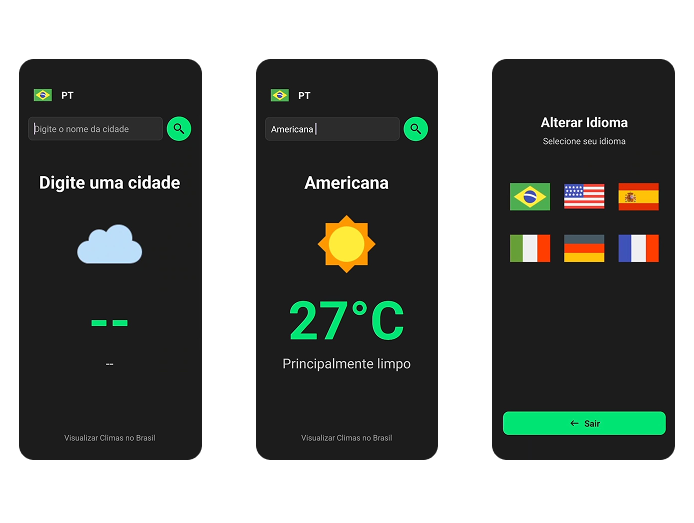

 🌐 <b>Languages:</b> <b>English 🇺🇸</b> • <a href="./README.pt-BR.md">Português 🇧🇷</a> 

🌤️ Brazil Weather App

Mobile application developed using Java and XML to display weather information for cities across Brazil.
The app provides a simple and intuitive interface, allowing users to quickly check current weather conditions.

 
🚀 Features

- Search weather by Brazilian cities
- Real-time weather information
- Clean and intuitive UI

 
🛠 Technologies

- Java
- XML (Android Layouts)
- Android Studio
- Weather API

 
💡 Usability

The application was designed with a focus on simplicity and usability.
Users can easily search for a city and instantly view its weather conditions, making the app practical for daily use.

 
📸 Application Interface
  
  
  
▶ How to Run the Project

- Clone the repository
- Open the project in Android Studio
- Sync Gradle dependencies
- Run the application on an emulator or physical device
